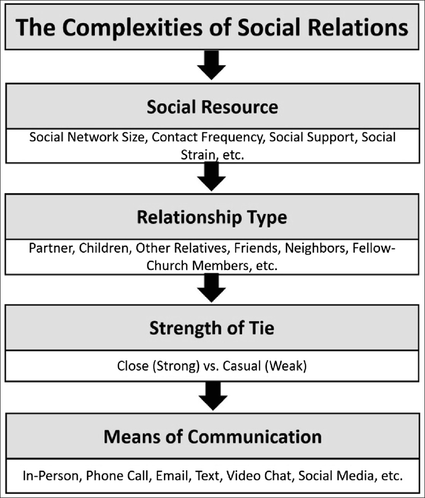

Motivation
===

# Social Media is failing to deliver genuine connections.
<!-- new_lines: 2 -->

# People are sharded online, current social media target engagement, not community.

<!-- new_lines: 2 -->
# There is no current platform/tool that puts users in control of their networks.

<!-- speaker_note: In today’s hyper-connected world, ironically, people feel more isolated than ever. Social media platforms once promised meaningful relationships but have shifted toward monetizing attention and data. This project is my response — to help people focus on real connections, starting with how we manage and view our contacts. -->

<!-- end_slide -->

State of the Art
===

<!-- column_layout: [2, 1] -->
<!-- column: 0 -->
# Importance of Social Relationships
* Strong correlation to physical, mental, and cognitive health.

# Importance of Intentionality in a Relationship
* Intentional, private, and meaningful social ties can positively impact well-being.

# Bridging the gap with my Thesis
<!-- column: 1 -->

<!-- reset_layout  -->

Sharifian N, Sol K, Zahodne LB, Antonucci TC. Social Relationships and Adaptation in Later Life. Comprehensive Clinical Psychology. 2022:52–72. doi: 10.1016/B978-0-12-818697-8.00016-9. Epub 2022 Apr 12. PMCID: PMC7500884.

<!-- end_slide -->

Problem Statement
===

# People struggle to maintain meaningful social connections once traditional structures (school, work) disappear.
<!-- new_lines: 2 -->

# Existing platforms fragment identity and communication, reinforcing disconnection and performative interactions.
<!-- new_lines: 2 -->

# There is a lack of private, intentional, and user-controlled tools for managing social relationships.

<!-- speaker_note: While social media offers connection in theory, in practice it often reinforces isolation and superficial interaction. After leaving school or university, many find it hard to maintain real bonds. At the same time, platforms divide our identities into public performances — one for work, one for friends, etc. What we’re missing is a way to genuinely manage, curate, and control our network in a personal and meaningful way. 
-->

<!-- end_slide -->

Research Question
===

# Does the integration of a privacy-first contact management tool improve:

* Interpersonal connectedness? 
* Intrapersonal well-being? 
* Awareness of relationship health?

<!-- speaker_note: The main research question is whether using this app can actually help people feel more connected and more grounded. We're exploring if simple awareness — through digital contact curation — can nudge behavior and improve quality of life. We'll look at social habits before and after usage, and reflect on how people perceive their relationships.
-->

<!-- end_slide -->

Proposed Solution
===

# A decentralized application that:

* Lets users manage personal contact information 
* Supports context-based “Personas” for selective sharing 
* Uses shareable links or QR codes for easy info exchange 
* Prioritizes privacy, simplicity, and user control

<!-- speaker_note: The app is a digital phonebook built for the 21st century — but without the baggage of big tech. You can manage and share your information flexibly, based on who you're interacting with — like a "work" vs. "gaming" persona. The design minimizes friction while maximizing autonomy. It's not a social media platform — it's a human tool.
-->

<!-- end_slide -->

Experimental Setup / Implementation Plan
===

# Research Setup:
* Design surveys (RS and BS-AS) and evaluation plan
* Recruit participants
## Implementation:
* Conduct research survey (RS)
* Build **prototype** (P)
* Conduct pre-usage survey (BS)
* Introduce participants to the app
* Conduct post-usage survey (AS)
* Collect usage data aggregate, where users opt-in
### Analysis:
* Evaluate feedback and write paper

<!-- speaker_note: Find participants, prepare 2 surveys (RS, BS/AS). Use RS to hone in specific needs for P. Finalize the app, run the Before Study, let time pass, run the After Study + optional usage data, and document the findings into a thesis.
-->

<!-- end_slide -->

Challenges
===

## Privacy concerns =🢖 mitigated by transparency and local storage
### Social desirability bias =🢖 indirect questions and anonymized responses 
#### Hawthorne effect =🢖 longer trial periods and realistic onboarding 
##### Confirmation bias =🢖 open-ended feedback and control group if possible

<!-- speaker_note: Bias and privacy issues are common in social studies, so we plan to address them from the start.
-->

<!-- end_slide -->
 
Expected Outcomes
===

# Increased user reflection on personal connections
<!-- new_lines: 2 -->

# Improved feeling of connectedness
<!-- new_lines: 2 -->

# Insight into design patterns for mindful tech
<!-- new_lines: 2 -->

# Foundation for future social tools beyond engagement metrics

<!-- speaker_note: We hope the app makes people more aware of their connections and inspires healthier digital habits.
-->

<!-- end_slide -->

Evaluation Plan
===

# Quantitative Scores [BS & AS]
* Interpersonal connectedness =🢖 Social Connectedness Scale
* Intrapersonal well-being =🢖 WHO-5
* Awareness of relationship health =🢖 Likert-Scale 5/7

# Qualitative [RS, BS & AS]
* Reflect on user experience, self reflection, and perceived utility.

# Usage Metrics [ where given ]

## Success Threshold
* \>= 10% increase in self-reported connectedness
* Positive feedback in \>= 70% of open responses
* Active usage during testing phase

<!-- end_slide -->

<!-- jump_to_middle -->
Q&A
===

<!-- end_slide -->

<!-- jump_to_middle -->
Thank you for participating
===
<!-- alignment: center -->

